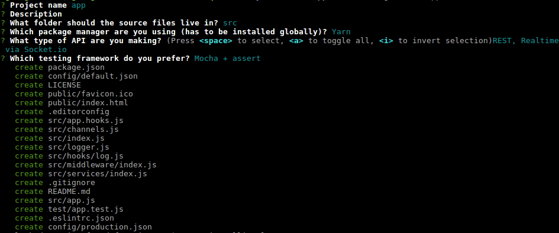
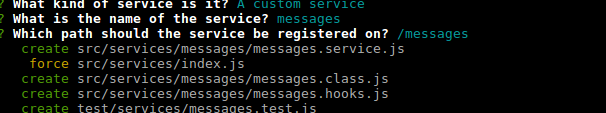
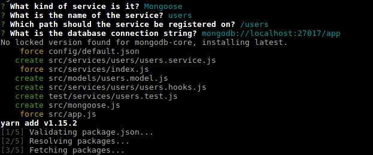
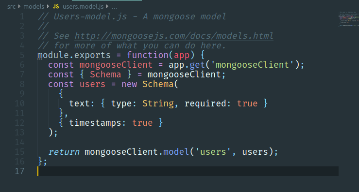

# Testing Feathers

[Feathers doc](https://docs.feathersjs.com/)

## Install and scaffold

```bash
npm install @feathersjs/cli -g
mkdir app
cd app/
feathers generate app
```

You should see something like this



Run with:

```bash
yarn start
```

## Services

Service methods are CRUD methods that a service object can implement. Feathers service methods are:

- find - Find all data (potentially matching a query).
- get - Get a single data entry by its unique identifier
- create - Create new data
- update - Update an existing data entry by completely replacing it
- patch - Update one or more data entries by merging with the new data
- remove - Remove one or more existing data entries

The parameters for service methods are:

- id - The unique identifier for the data
- data - The data sent by the user (for creating and updating)
- params (optional) - Additional parameters, for example the authenticated user or the query

```JavaScript
const myService = {
  async find(params) {
    return [];
  },
  async get(id, params) {},
  async create(data, params) {},
  async update(id, data, params) {},
  async patch(id, data, params) {},
  async remove(id, params) {}
};

app.use('/my-service', myService);
```

### Generathing a message service

```bash
feathers generate service
```



#### Testing message service

Request:

```bash
curl 'http://localhost:3030/messages/5' -Hntent-Type: application/json'
```

Response:

```json
{ "id": "5", "text": "A new message with ID: 5!" }
```

This is because we have our default service get method, it looks this way:

```JavaScript
// src/services/messages/messages.class.js

class Service {

  ...

  async get(id, params) {
    return {
      id,
      text: `A new message with ID: ${id}!`
    };
  }

  ...

}
```

**More on [Services](https://docs.feathersjs.com/guides/basics/services.html).**

### Generating a service for a mongoose model

We will be using [feathers-mongoose](https://github.com/feathersjs-ecosystem/feathers-mongoose) plugin (it will be installed automatically).

Generating the service is the same as before:

```bash
feathers generate service
```

You have to specify the mongodb uri on the first mongose service you generate. It will configure its connection for you automatically and it won't be asked twice. How cool is that?!



This is how your model will look like at first. Check [Mongoose](http://mongoosejs.com/docs/models.html) doc for more.



#### Querying

_To be done..._ Check [FeathersJS official querying doc](https://docs.feathersjs.com/api/databases/querying.html) while so.
